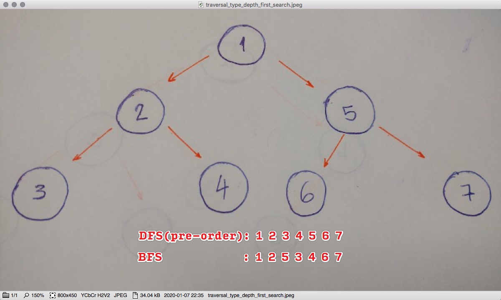

### Chapter Goals
> This chapter introduces trees and some algorithms that use trees. By the end of the chapter you should be able to answer these questions.
- How are trees constructed?
- How can we traverse a tree?
- How are expressions and trees related?
- What is a binary search tree?
- Under what conditions is a binary search tree useful?
- What is depth first search and how does it relate to trees and search problems? - What are the three types of tree traversals we can do on binary trees?
- What is a grammar and what can we do with a grammar?

### Confusions
- [*Pre-order traversal* versus *Depth-first search*](https://softwareengineering.stackexchange.com/questions/227779/is-pre-order-traversal-same-as-depth-first-search)

### Terminology summary <small>([*ref*](https://www.freecodecamp.org/news/all-you-need-to-know-about-tree-data-structures-bceacb85490c/))</small>
- *Root* is the topmost `node` of the tree
- *Edge* is the link between two `nodes`
- *Child* is a `node` that has a `parent node`
- *Parent* is a `node` that has an `edge` to a `child node`
- *Leaf* is a `node` that does not have a child node in the `tree`
- *Height* is the length of the longest path to a `leaf`
- *Depth* is the length of the path to its `root`
- *Binary Tree* is a tree DS in which each `node` has **at most two children**.
- *Binary Search Tree* is a `rooted binary tree` whose internal nodes each store a key (e.g. 3 -> l:1 r:6)
  - RIGHT: greater than all the keys in the node's left subtree (r: 6)
  - LEFT: less than those in its right tree (l: 1)

### Types of *search*
> There are *more* types of **graph** algorithms other than *DFS* and *BFS* <u>**if** you consider the *tree* as a *graph*</u> <small>(an *undirected graph* which <u>any two vertices are connected by exactly one path</u>)</small>. But there's *only* two-ish <small>(common types)</small> if you simply consider it as a *tree*,
- *Depth-First* Search <smallif>(aka. **DFS**)</smallif>
    - It is an algorithm for *traversing* or *searching* <u>tree data structure</u>
        > 1) one starts at the root & explores AFAP along each branch before backtracking 
        > 2) the process is the *same* as the <u>pre-order traversal</u>
    - Types of DFS *tree traversals*
        - `pre-order`
            > TOP -> LEFT -> LEFT .. THE_REST -> RIGHT -> LEFT .. THE_REST

        - `in-order`
            > BOTTOM -> LEFT|MIDDLE|RIGHT -> .. TOP .. -> LEFT|MIDDLE|RIGHT

        - `post-order`
            > BOTTOM -> LEFT|RIGHT|MIDDLE -> LEFT|MIDDLE|RIGHT -> .. TOP

- *Breadth-First* Search <small>(aka. **BFS**)</small>
    - It is an algorithm for *traversing* or *searching* <u>tree data structure</u>
        > <q>it starts at the tree root & explores explores the neighbor nodes first, before
        moving to the next level neighbours</q>
        >> 
    - Types of BFS *tree traversals*
        - `level-order`
            > subtree-LR -> subtree-L(subtree-LR)-R(subtree-LR) -> ... (to the leaf node)
- Else
  - [*Monte Carlo tree search*](https://en.wikipedia.org/wiki/Monte_Carlo_tree_search)

### References
- [4 Types of Tree Traversal Algorithms](https://towardsdatascience.com/4-types-of-tree-traversal-algorithms-d56328450846)
