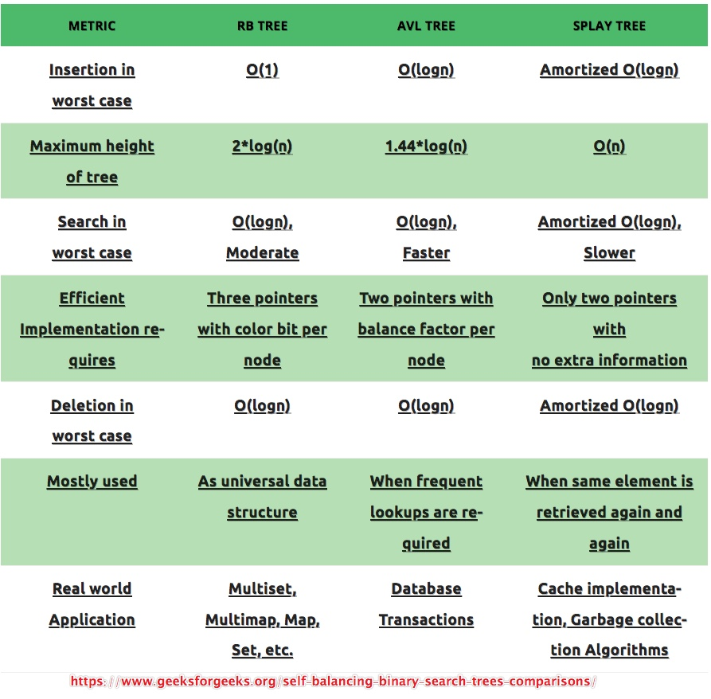

### Term
- Difference between a *Balanced Binary Search Tree* and a *Binary Search Tree*
    - Short [answer](https://stackoverflow.com/questions/31027422/what-is-the-difference-between-a-balanced-binary-search-tree-and-a-binary-search): a *Balanced Binary Search Tree* one has the **possibly minimum height**
    - Long answer: see [Definition of a Balanced Tree](https://stackoverflow.com/questions/8015630/definition-of-a-balanced-tree) on *stackoverflow*

### The word *balanced*
- *Part of Speech*
    - It's a [*type*](https://en.wikipedia.org/wiki/Self-balancing_binary_search_tree#Implementations).
    - It could also be called as *self-balancing binary search tree* or *height-balanced binary search tree*.
    - It keeps *Binary Search Trees* **great**
        > One of the *advantages* of *Tree* is that it could achieve [*logarithmic running time*]   (https://stackoverflow.com/questions/2307283/what-does-olog-n-mean-exactly), well, as good as  it sounds, it does have worst cases like `O(n)` when the tree become *unbalanced*.
- *Definition*
    > *Self-Balancing Binary Search Trees* are *height-balanced binary search trees* that **automatically keeps height as small as possible** when *insertion* and *deletion* operations are performed on tree. The height is typically maintained in order of `Log n` so that all operations take `O(log n)` time on average.
- *Capability*
    1. It provides `O(log n)` *insert*, *delete* and *lookup* operations.
    2. It maintains its items in ***order*** (ascending).
    3. An [*in-order* ](https://en.wikipedia.org/wiki/Tree_traversal#In-order_(LNR)) traversal could be accomplished in `O(n)` time if the tree is *already built*.
- *Difference*
    > The *HashSet* & *HashMap* does provide *very efficient* <small>(e.g. `O(log n)`, `O(1)`)</small> *insert*, *delete* and *lookup* operations. So does *Heaps* <small>(`O(log n)` for *insert* and *delete*)</small>. But neither of them maintain their elements as an *ordered sequence*. Use it when you want to do lots of *insert/delete* operations <u>and</u> need to **iterate over a sequence in *ascending/descending order*, many times prehaps as well.
- A detailed [comparison](https://www.geeksforgeeks.org/self-balancing-binary-search-trees-comparisons/) of different *self-balanced Binary Search Trees*
    - 

### References
- [Self-balancing binary search tree](https://en.wikipedia.org/wiki/Self-balancing_binary_search_tree)
- [Tree traversal](https://en.wikipedia.org/wiki/Tree_traversal)
- [Self-Balancing-Binary-Search-Trees (Comparisons)](https://www.geeksforgeeks.org/self-balancing-binary-search-trees-comparisons/)
